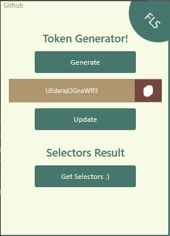
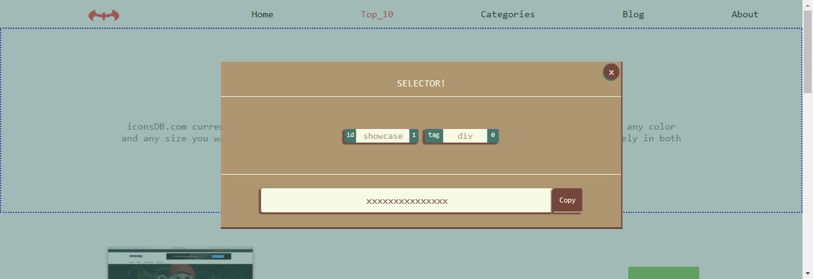
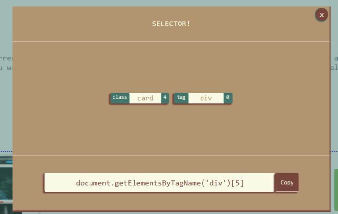

# For Lazy Scrapers

    
    
    

## Overview

"For Lazy Scrapers" is a Chrome extension designed to simplify the process of obtaining HTML selectors for web scraping. It aims to streamline the scraping workflow by automating the generation of selectors, eliminating the need for manual inspection and selection.

## Features

### 1. Token Generation and Injection

- **Generate Token:** Easily generate a unique token.
- **Inject Token:** Inject the generated token into the HTML target element.

### 2. Quick Selector Retrieval

- **Get Selectors:** Obtain element ID, classes, and tag selectors with just a few clicks.
- **Effortless Scraping:** Reduce the regular process of navigating the inspector and searching for elements.

### 3. Visual Enhancements

- **Highlighting/Bordering:** Visually highlight or border the target element for easy identification.

### 4. Easy Switching Between Elements

- **Switch Targets:** Effortlessly switch between target elements during the scraping process.

### 5. Copy To Clipboard

- **One click = One Copy:** Effortlessly copy the chosen selector to clipboard
## Inspiration

The inspiration behind creating "For Lazy Scrapers" was a desire to make web scraping feel more natural and less cumbersome. By automating the selector generation process, the extension aims to simplify scraping tasks, especially for users who find the traditional approach time-consuming.

## Target Audience

This extension is designed for anyone involved in web scraping. Whether you're a seasoned scraper or a beginner, "For Lazy Scrapers" provides a user-friendly and efficient way to collect HTML selectors.

## Note

**Please Note:** "For Lazy Scrapers" is intended for legitimate and ethical web scraping purposes. Ensure that you comply with the terms of service of the websites you scrape, and refrain from engaging in any illegal or unethical scraping activities.

## Future Plans

"While Lazy Scrapers" is currently a tool, future updates may transform it into a full-fledged project with additional features, such as:

- Group selectors.
- A small window displaying current element information.
- Enhanced selector options like XPath and combined selectors (tag + attribute).
- Local storage for history and templates for popular websites.

## Technology Stack

- HTML
- CSS
- Vanilla JavaScript
- Chrome Extension API

## Usage

1. Install the extension in your Chrome browser.
2. Open a webpage for scraping.
3. Use the extension's features to generate tokens, retrieve selectors, and enhance the visual experience.
4. Enjoy a more streamlined and efficient web scraping process!

## License

This extension is licensed under the [MIT License](LICENSE).

---

**Happy Scraping!**
